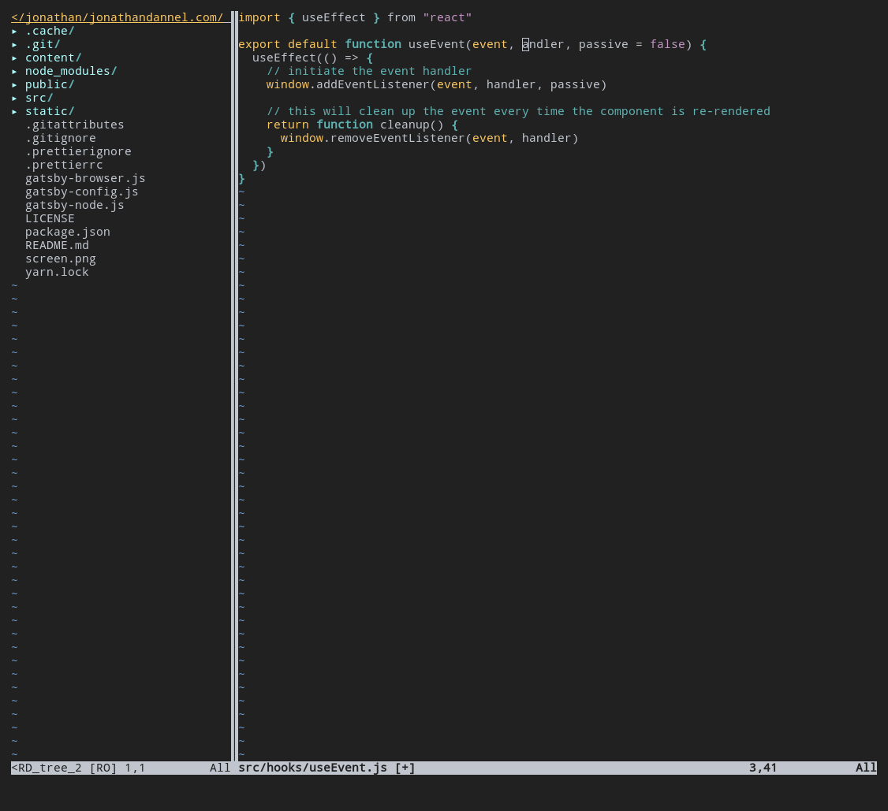
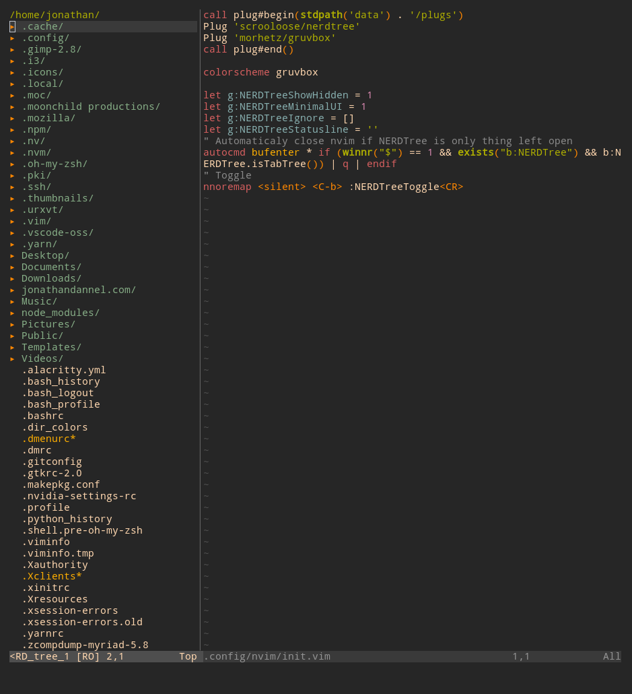
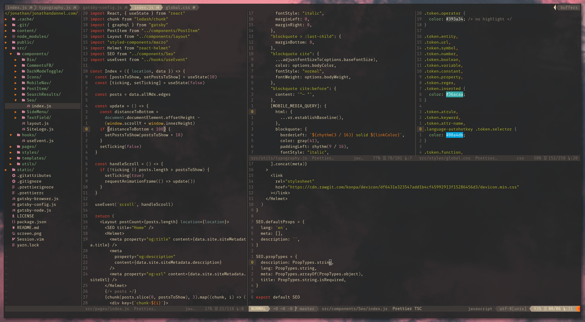

I learned the very basics of vim a few years ago as a junior editing my first server config files over SSH. I honestly found it pretty arcane while using it to do anything meaningful (or upon being thrown into it during Git merges), which turned me off from it for a long time. However, ever so often along my professional journey, I would encounter the rare developer sporting an impressive vim + tmux setup that, as an uninitiated observer, seemed mystical and esoteric. Each time I witnessed the effortlessness in which these sorcerers could hop around large codebases, edit at superhuman speed, and multitask — all without a mouse or traditional GUI — I was inspired.

My vim journey personally began in earnest a few years later when I finally committed to `vimtutor`, bought a [book](https://www.amazon.ca/Practical-Vim-Edit-Speed-Thought/dp/1680501275) on vim, and forced myself to use [vim mode](https://github.com/VSCodeVim/Vim) in VSCode. After a while, I started gaining real proficiency and wondered about the next steps.

- _How do I switch to vim without feeling like I'm stuck in 1995?_

- _Can I really leave behind all the niceties of editors like VSCode?_

- _But... will my linters and formatters still work?_

These were the questions I was asking myself, and they took me down a deep rabbit hole. As it turns out, vim has a huge, loyal following with a mind-bogglingly vast number of plugins and ways to extend its functionality. It's ubiquitous and hackable to its core; If you can think it, you can do it in vim. After a fair amount of time experimenting, what I ended up with was a lightning fast editor with almost zero memory footprint that could do everything I wanted and more, all while looking awesome and being a joy to use.

> Disclaimer: I'm by no means a vim expert. I've written this step-by-step instructional guide with the intention of simplifying the transition to modern, full-time vim usage for those who are currently vim-curious and perhaps a little bit intimidated.

So, without further fanfare, let's get started!

## Step one: Get neovim

Neovim is basically a more modern fork of vim, introducing some (argurable) performance and quality of life improvements. It's backwards compatible with most vanilla vim features/plugins and adds some new functionality too.

Detailed, platform specific installation instructions can be found on the [neovim repo](https://github.com/neovim/neovim/wiki/Installing-Neovim).

For simplicity, I always prefer using a package manager.

- On Arch and derivatives:

  - `sudo pacman -S neovim`

- On Debian/Ubuntu:

  - `sudo apt install neovim`

- On a Mac:

  - `brew install neovim`

> Note: From here on out, the assumption is that we're using neovim, not vim. 

## Install a plugin manager 

While it's possible to manually clone plugin repos/files and play cat's cradle with your vim directories, it's way easier to use a plugin manager to handle everything. The two most popular solutions in this arena are `vim-plug` and `vundle`. Personally, I like vim-plug.

You can install it easily via `curl`:

```bash
sh -c 'curl -fLo "${XDG_DATA_HOME:-$HOME/.local/share}"/nvim/site/autoload/plug.vim --create-dirs \
       https://raw.githubusercontent.com/junegunn/vim-plug/master/plug.vim'
```

> Note: The rest of this tutorial will assume usage of vim-plug, but feel free to try something else!

## Create your config file(s)

If you followed the above install script or added `vim-plug` via other means, the next step is to find/create your config and start editing it.

`mkdir ~/.config/nvim && touch ~/.config/nvim/init.vim`

This is where your nvim config will exist from now on. Note that you may choose to migrate whatever vanilla vim settings you may or may not have accumulated by adding the line `source ~/path/to/your.vimrc` to your init file.  

## Edit init.vim

Add these two lines to your config:

```javascript
call plug#begin(stdpath('data') . '/plugs')
call plug#end()
```

In between these two lines, you're going to declare all packages you want to import and use in your config. Be sure to note the following:

- `stdpath('data')` resolves to your `~/.local/share/nvim` directory. 

- `plugs` can be renamed to anything you like; It's the directory we're going to use to store our plugins (which will be created if it doesn't already exist). 

 `stdpath('config')` refers to the directory we just made in `~/.config`, which is where `init.vim` lives. We're not using it right now, but it's good to know.

## Creating the IDE look

The first order of business is to make vim look pretty. Thankfully, this isn't too difficult.

- ### Adding a file tree

Vim, by default, does not include an anchored file tree where you can easily get an overview of all the directories and files in a project. Generally, [nerdtree](https://github.com/preservim/nerdtree) is a popular solution.

The syntax for vim-plug package imports is `Plug <github repo>'`. So, after adding `nerdtree`, our `init.vim` will look like this:

```javascript
call plug#begin(stdpath('data') . '/plugs')
Plug 'preservim/nerdtree'
call plug#end()
```

Now, let's fire up vim-plug and let it do its thing! In your terminal, type in

`nvim +PlugInstall`

and everything between `plug#begin()` and `plug#end()` will be installed.

Open up `init.vim` again and let's bind NERDTree to a key and define some basic options. Add the following <strong>after</strong> your imports:

```javascript
let g:NERDTreeShowHidden = 1
let g:NERDTreeMinimalUI = 1
let g:NERDTreeIgnore = []
let g:NERDTreeStatusline = ''
nnoremap <silent> <C-b> :NERDTreeToggle<CR>
" Automaticaly close nvim if NERDTree is only thing left open
autocmd bufenter * if (winnr("$") == 1 && exists("b:NERDTree") && b:NERDTree.isTabTree()) | q | endif
```

We're showing hidden (dot) files, using a minimal UI, not ignoring any files, not adding a status line, and binding a toggle key to show/hide the file tree.

Reload nvim, open a directory, and press `CTRL` + `b` while editing. You should see all files in the directory you ran it from. This is alright, but it all looks rather ugly still:



- ### Adding a color scheme

There are tons of really awesome color schemes for vim. Let's choose one from here:

https://github.com/rafi/awesome-vim-colorschemes

I'm gonna go with https://github.com/morhetz/gruvbox because it's classic, and Gruvbox is awesome.

Just add `Plug morhetz/gruvbox` before the `#plug end` to import the repo as a plugin.

After your plugin block, add `colorscheme gruvbox` on a new line to set the color scheme. Then do an `nvim +PlugInstall` from your terminal to once again install any new plugins. Reload nvim and you should see your color scheme change.



That looks a bit better.

What I also like to do is change my terminal's background color to match the theme's background color. I'm using alacritty, so in this case, I'll edit my `.alacritty.yml` to use a background color of `#262626`.

Now's also a decent time to add a few boilerplate settings. After your colorscheme declaration (or wherever, as long as it's not in the plugin import block), add the following:

```javascript
syntax enable
:set termguicolors
:set background=dark
:set relativenumber
:set numberwidth=3
```

Personally, I like relative line numbers for quicker, more accurate jumps between lines, but if you like seeing absolute line numbers, just use `:set number` instead of `:set relativenumber`.


- ### Adding a custom status line

Airline is a lighter weight version of Powerline, which is itself a popular status line plugin for vim. 

You should definitely check out the repo and refer to the docs: https://github.com/vim-airline/vim-airline

In the plugin import block, add these:

```javascript
Plugin 'vim-airline/vim-airline'
Plugin 'vim-airline/vim-airline-themes'
```

In the body of your config, set some options:

```javascript
let g:airline#extensions#tabline#enabled = 1
let g:airline_powerline_fonts = 1
let g:airline#extensions#tabline#fnamecollapse = 1
let g:airline#extensions#tabline#fnamemod = ':t'
```

Choose a theme from the list (https://github.com/vim-airline/vim-airline-themes/blob/master/doc/airline-themes.txt) and enable it:

I'm going to set it as `gruvbox` since the gruvbox theme we imported actually has some entries for airline colors already included. But feel free to add anything you want! You can also change the airline colorscheme or look for a new one on the fly inside nvim by typing `:AirlineTheme` and pressing `Tab` to get a list of all themes.

```javascript
let g:airline_theme='gruvbox'
```

Restart nvim and you should see a status line at the bottom of your window as well as some tab and buffer indicators at the top. Airline is super customizable, so follow the docs to add and remove items from the UI as you see fit. 

Keep in mind that since we've enabled powerline fonts, the nice glyphs it gives us won't render correctly unless you have patched fonts on your system. We'll go through that in a minute.

- ### Adding icons

```javascript
Plug 'ryanoasis/vim-devicons'
```

Note: These might not render correctly yet for the aforementioned reason. We'll fix that now.

- ### Installing a patched font

If you aren't seeing icons in your file tree after installing `vim-devicons`, or if your status line is full of random symbols, that means you need to install a patched font. On a fresh install of Manjaro i3, it seems that these fonts are included already, but from my experience they're not included with most distros.

Two decent options are:

- https://github.com/powerline/fonts
- https://github.com/ryanoasis/nerd-fonts

I really like the selection of Nerd fonts, so let's go with those.

Navigate to the font you want to use. Fira Mono is a decent and unoffensive choice for now..
https://github.com/ryanoasis/nerd-fonts/tree/master/patched-fonts/FiraMono/Regular

In the `complete` dir, grab the .ttf file you want (`Fira Mono Regular Nerd Font Complete.otf`) and move it to `~/.local/share/fonts/`. You may have to create this directory if it doesn't exist.

Now, refresh your font cache (or log in/out):

`sudo fc-cache -f -v`

In your terminal settings, you can now specify that font as the default. If you're using a terminal without a GUI for setting options, like alacritty, you need to specify the actual family for the font.

Run `fc-list | grep Fira` and you should get something back like
`/home/jonathan/.local/share/fonts/Fira Mono Regular Nerd Font Complete.otf: FiraMono Nerd Font:style=Regular`

The actual name of the font, in this case, is `FiraMono Nerd Font`. So you'd specify it that way in your alacritty config:

```yaml
font:
  normal:
    family: FiraMono Nerd Font
    size: 10
```

Reload your terminal and you should now see all your nice new icons when you open nvim.

There are more streamlined ways of adding patched fonts (various scripts and such), but I find this method pretty quick and hassle free. You can check the powerline/nerd repos and docs for more methods if this one doesn't suit you.

- ### Adding some transparency 

Sometimes it's nice to have a little bit of transparency in your terminal. However, if you change your terminal's opacity, your vim theme background will still be a solid color. Adding this line to your config can fix that:

```javascript
:hi! Normal guibg=NONE
```

This can be kind of distracting, but it has an undeniable cool factor! :)

## Adding functionality

Now that we're more or less through with making things look pretty, know how to add plugins, and understand how to edit the config, let's run through a bunch of small additions in quick succession.

- ### Fuzzy finding (CTRL + P to open file)

Probably my favorite plugin. It renders the file tree pretty useless once you're used to just launching new splits from `fzf`. This, in turn, saves screen space and allows you room for another split or two.

In your plugin block:

```bash
Plug 'junegunn/fzf', { 'dir': '~/.fzf', 'do': './install --all' }
Plug 'junegunn/fzf.vim'
```

In the body of your config, add some custom binds to launch splits from fzf (or else fzf files will open in the current pane). Also, bind this to the familiar `CTRL` + `p`.

```javascript
nnoremap <C-p> :FZF<CR>
let g:fzf_action = {
  \ 'ctrl-t': 'tab split',
  \ 'ctrl-s': 'split',
  \ 'ctrl-v': 'vsplit'
  \}
```

Now you can use `CTRL` + `p` to directly open and jump to any file in your project. And, in the case of the bindings above, use `CTRL` + `v` to open the selected file in a vertical split.

- ### Auto closing tags (html, jsx, etc) 

https://github.com/alvan/vim-closetag

```bash
Plug 'alvan/vim-closetag'
```

And some config:

```javascript
let g:closetag_filenames = '*.html,*.xhtml,*.phtml,*.js,*jsx'
let g:closetag_xhtml_filenames = '*.xhtml,*.jsx,*.js'
let g:closetag_filetypes = 'html,xhtml,phtml,*.js'
let g:closetag_xhtml_filetypes = 'xhtml,jsx,js'
let g:closetag_emptyTags_caseSensitive = 1
let g:closetag_regions = {
    \ 'typescript.tsx': 'jsxRegion,tsxRegion',
    \ 'javascript.jsx': 'jsxRegion',
    \ }
let g:closetag_shortcut = '>'
```

- ### Git integration

https://github.com/tpope/vim-fugitive

Run git commands in vim, and more

```javascript
Plug 'tpope/vim-fugitive'
```

- ### Visual, inline git diffs

https://github.com/airblade/vim-gitgutter

```javascript
Plug 'airblade/vim-gitgutter'
```

- ### Toggle line commenting

https://github.com/preservim/nerdcommenter

```javascript
Plug 'airblade/vim-gitgutter'
```

- ### Auto closing brackets/parens

https://github.com/jiangmiao/auto-pairs

> Note: This could get annoying if not configured correctly. Check the repo and docs.

```javascript
Plug 'jiangmiao/auto-pairs'
```

- ### Or surround.vim

https://github.com/tpope/vim-surround
```javascript
Plug 'tpope/vim-surround'
```

- ### Persistent sessions

https://github.com/tpope/vim-obsession

```javascript
Plug 'tpope/vim-obsession'
```

Now you can type `:Obsession` to start tracking your vim session (open buffers, splits, marks, etc). Close vim, and then run `nvim -S` to reload the session exactly as it was. I love this one.

## Miscellaneous options

- ### Remap some keys (optional)

All the different ways to remap vim's core bindings are out of the scope of this post, but here are a couple of simple ones that make life a little easier.

- Use `ALT` + `h j k l` to move between splits

```javascript
tnoremap <A-h> <C-\><C-n><C-w>h
tnoremap <A-j> <C-\><C-n><C-w>j
tnoremap <A-k> <C-\><C-n><C-w>k
tnoremap <A-l> <C-\><C-n><C-w>l
nnoremap <A-h> <C-w>h
nnoremap <A-j> <C-w>j
nnoremap <A-k> <C-w>k
nnoremap <A-l> <C-w>l
```

- Remap `ESC` in insert mode

```javascript
inoremap jk <Esc>
inoremap kj <Esc>
```

Remapping keys is totally subjective, so I'll leave it at that.

- ### Yank to clipboard

```javascript
:set clipboard=unnamedplus
```

- ### Indentation
- `:set tabstop=2`: The amount of spaces a tab is equal to.
- `:set autoindent`: New lines inherit the indentation of previous lines.
- `:set expandtab`: Convert tabs to spaces.
- `:set shiftround`: When shifting lines, round the indentation to the nearest multiple of “shiftwidth.”
- `:set shiftwidth=2`: When shifting, indent using four spaces.
- `:set smarttab`: Insert “tabstop” number of spaces when the “tab” key is pressed.

- ### Searching

- `:set ignorecase`: Ignore case when searching.
- `:set smartcase`: Automatically switch search to case-sensitive when search query contains an uppercase letter.

## Language specific functionality

- ### Code completion

`Coc.nvim` is a great choice for multi-language support. It's an all around awesome package that has never failed me in Python, Javascript, and Go.

Add it as a plugin:

```javascript
Plug 'neoclide/coc.nvim', {'branch': 'release'}
```

Since I'm primarily a web dev that works with React and Node.js, there are two things that are an absolute necessityfor real world projects: `eslint` and `prettier`. First, we need to set up a language server or install a `coc` extension. Without a language extension, we can't get intellisense to work.

For Javascript, the recommended extension is `coc-tsserver`. This handles both Typescript and Javascript syntax.

We can either run an install command within nvim (`:CocInstall <extension>`) or we can specify a list of extensions to load in our config, then run `:CocInstall`. The latter is more organized and makes more sense to me, so let's do that.

In init.vim:

```javascript
let g:coc_global_extensions = ['coc-emmet', 'coc-css', 'coc-html', 'coc-json', 'coc-tsserver']
let g:coc_disable_startup_warning = 1
```

We're adding support for Emmet, CSS, HTML, JSON, and JS/TS. There are tons of languages (Go, Python, etc) and frameworks (like Flow for JS) that Coc.nvim supports, so check out the list and add the extensions you need to that array.

https://github.com/neoclide/coc.nvim/wiki/Language-servers

Open up nvim and run `:CocInstall`. Nice!


- ### Prettier to format on save

Add `coc-prettier` to the list in `g:coc_global_extensions`, then add the following under the other coc settings:

```javascript
command! -nargs=0 Prettier :CocCommand prettier.formatFile
let g:prettier#autoformat = 1
```

Create a file in your `nvim` directory called `coc-settings.json` and add a line for configuring formatting on save. Add or remove relevant filetypes as you see fit:

```json
{
  "coc.preferences.formatOnSaveFiletypes": [
    "javascript",
    "javascriptreact",
    "typescript",
    "typescriptreact",
    "json",
    "graphql"
  ]
}
```

Install, reload, and prettier should be working properly and responding according to the rulesets defined in your project's prettier config file.

- ### Eslint

Same as above. Add `coc-eslint`, and in your `coc-settings.json` add:

```json
"eslint.options": { "configFile": "C:/mydirectory/.eslintrc.json" }
```

`coc-eslint` is super customizable and interoperable with prettier. More detailed instructions can be found [in the eslint docs] (https://github.com/neoclide/coc-eslint) and [prettier docs](https://github.com/neoclide/coc-prettier)

Linters and formatters for other languages generally work in similar ways, so be sure to give them a try.

## That's just the tip of the iceberg

This post was a very basic introduction to getting your config started up and functional for every day use, but there's so much more to explore, and so many cool ways to extend your config. 

If you followed the guide, you'll end up with something like this:



> The source code for everything covered in this walkthrough is located [here](https://github.com/jonathandannel/nvim).

Hopefully now that you've seen first hand how extensible and cool vim can actually be (and not actually too troublesome to set up), you'll go off on your own and make your own sweet configuration and give it a try for a while. [VimAwesome](https://vimawesome.com/) is a great resource for exploring what else is out there and ready to be dropped into your config. 

If the vim workflow suits you, it may be worthwhile looking into two things to round out your experience:

- A terminal multiplexer like `tmux`. Google it, it's incredible. It's an integral part of many vim users' setups. 
- A tiling window manager (if you're on Linux). This can replace a lot of what tmux brings to the table, except if you require persistent SSH connections. 
  - [i3wm](https://i3wm.org/)
  - [awesome](https://awesomewm.org/)

Those are way out of the scope of this post, but worthwhile to keep in mind (and in my opinion, pretty necessary additions to a productive workflow). I personally <strong>love</strong> i3. 

> Before setting yourself up for disappointment: Vim, as awesome as it is, isn't the be all end all of text editors and is not always a suitable replacement for an IDE. If, for example, you're developing huge enterprise Java applications with lots of build scripts or Android/iOS apps requiring tons platform specific plugins, it's probably not the right tool for the job. It works awesomely for me, though, and so I wanted to share my experience with you.

Thanks for reading, and happy hacking :)
